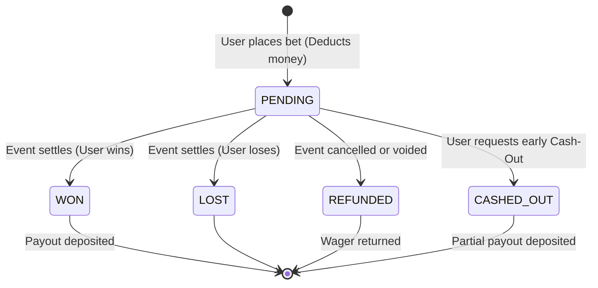

# Máquina de Estados de la Apuesta (Bet)

Este diagrama modela el ciclo de vida de un ticket de apuesta (Bet).

```mermaid
stateDiagram-v2
    [*] --> PENDING : User places bet (Deducts money)
    
    PENDING --> WON : Event settles (User wins)
    PENDING --> LOST : Event settles (User loses)
    PENDING --> REFUNDED : Event cancelled or voided
    PENDING --> CASHED_OUT : User requests early Cash-Out

    WON --> [*] : Payout deposited
    LOST --> [*]
    REFUNDED --> [*] : Wager returned
    CASHED_OUT --> [*] : Partial payout deposited
```
