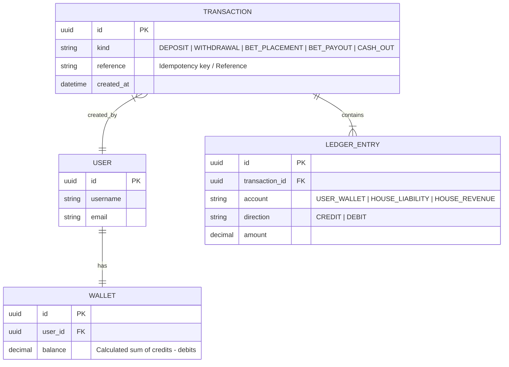

# Diagrama ER de la Billetera (Wallet)

El siguiente diagrama de Entidad-Relación describe el modelo de **Partida Doble** (Double-Entry Ledger) utilizado para garantizar la integridad financiera en la casa de apuestas.

