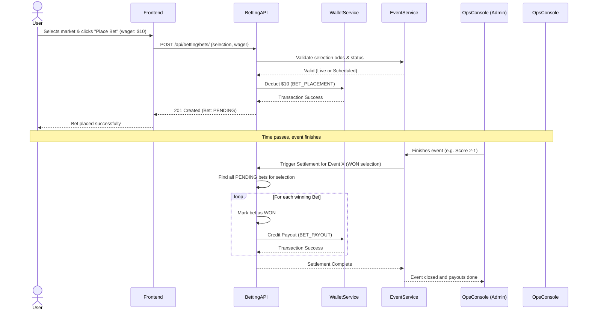

# Secuencia: Apuesta a Liquidación

Este diagrama muestra cómo interactúa el usuario con el sistema al momento de realizar una apuesta y cómo el backend procesa la liquidación automática de los pagos.

