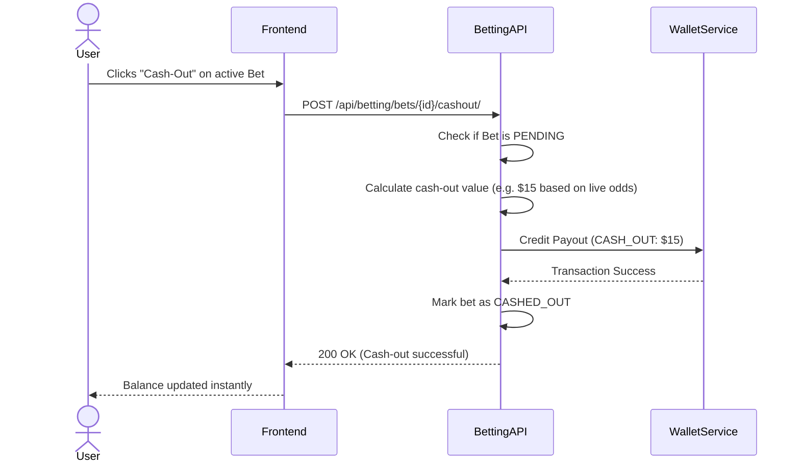

# Secuencia: Cash-Out (Retiro Anticipado)

Este diagrama muestra cómo un usuario puede retirar su apuesta anticipadamente por un valor parcial de la ganancia potencial.

```mermaid
sequenceDiagram
    actor User
    participant Frontend
    participant BettingAPI
    participant WalletService

    User->>Frontend: Clicks "Cash-Out" on active Bet
    Frontend->>BettingAPI: POST /api/betting/bets/{id}/cashout/
    BettingAPI->>BettingAPI: Check if Bet is PENDING
    BettingAPI->>BettingAPI: Calculate cash-out value (e.g. $15 based on live odds)
    BettingAPI->>WalletService: Credit Payout (CASH_OUT: $15)
    WalletService-->>BettingAPI: Transaction Success
    BettingAPI->>BettingAPI: Mark bet as CASHED_OUT
    BettingAPI-->>Frontend: 200 OK (Cash-out successful)
    Frontend-->>User: Balance updated instantly
```
